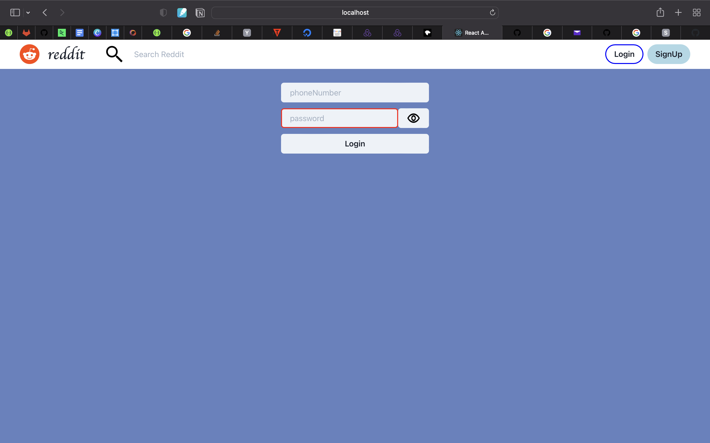
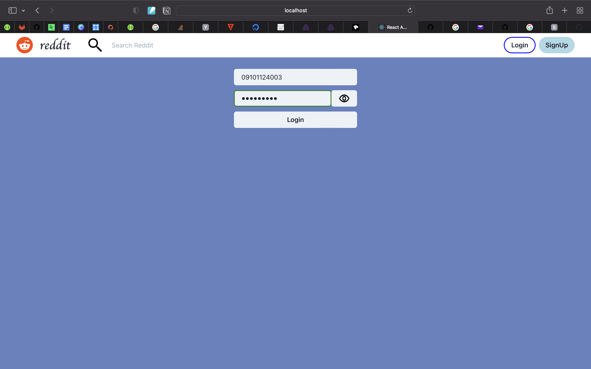
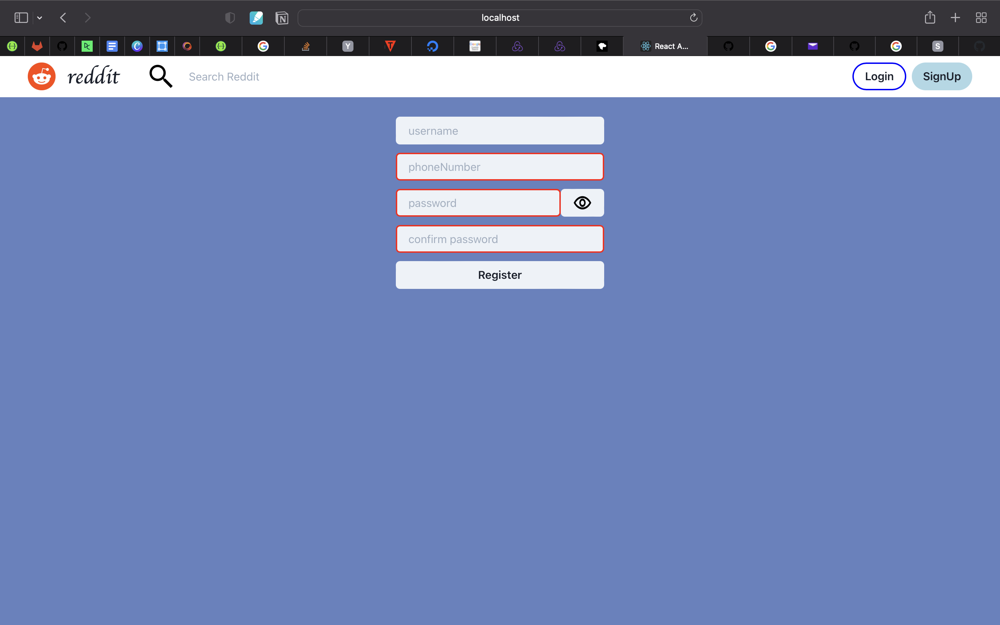
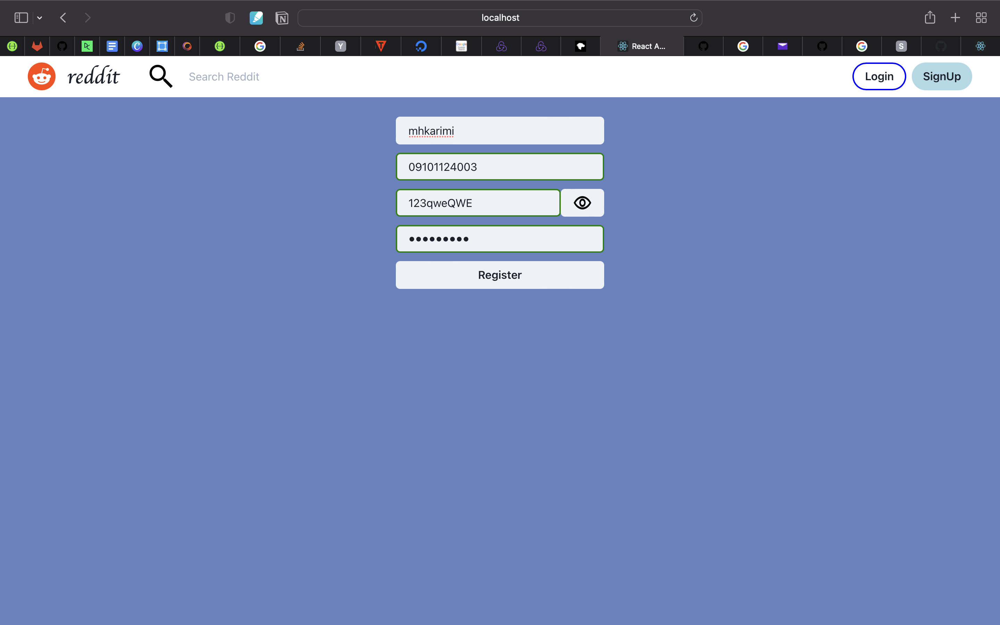
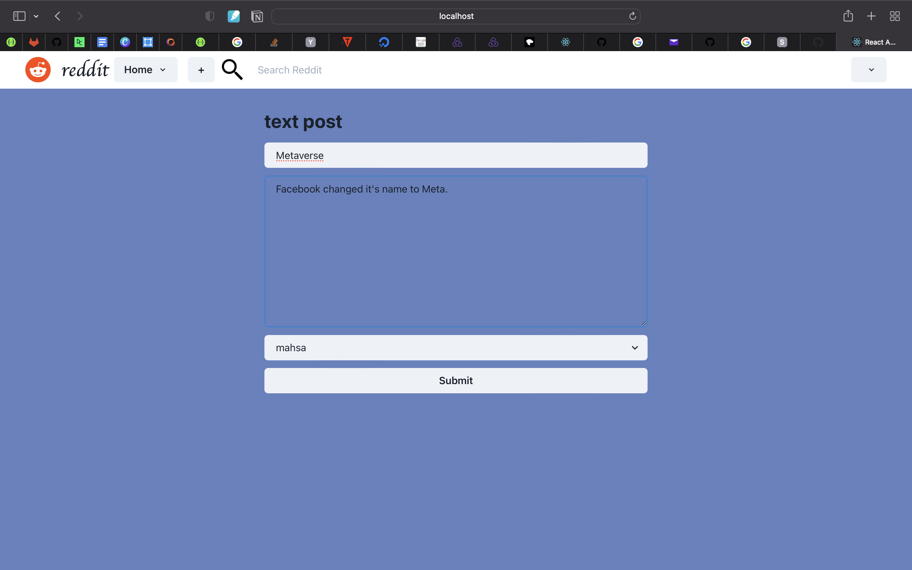
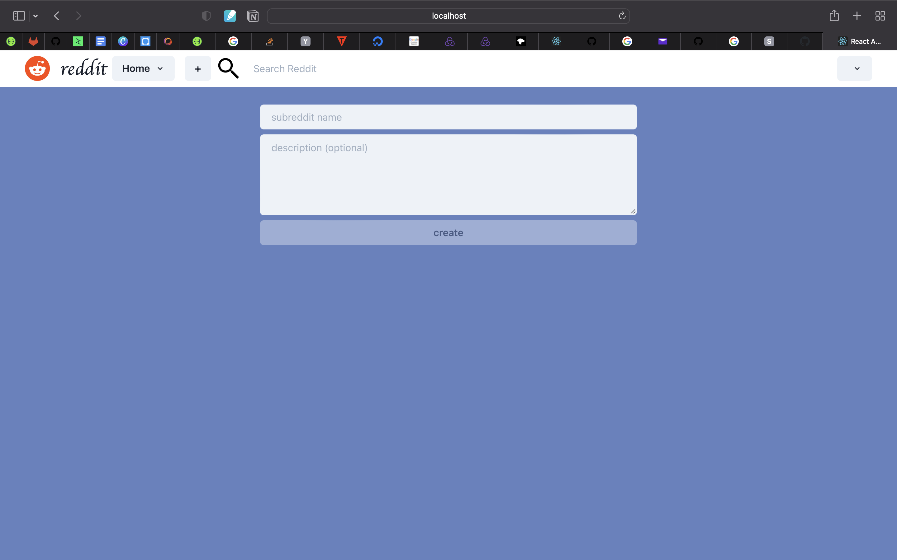
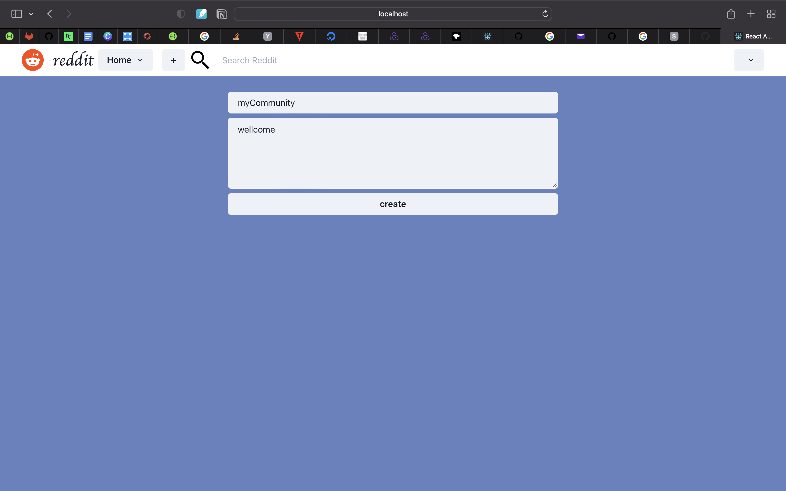
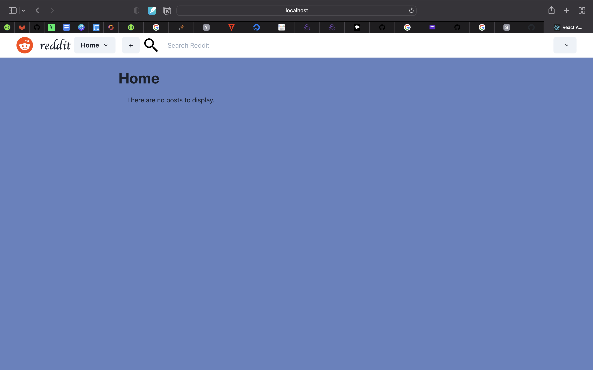
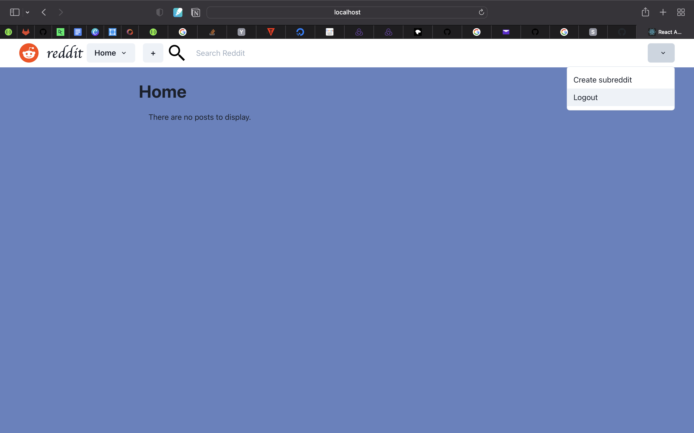

# reddit_IE
for final IE project

# Getting Started with Create React App

This project was bootstrapped with [Create React App](https://github.com/facebook/create-react-app).

## Available Scripts

In the project directory, you can run:

### `npm start`

Runs the app in the development mode.\
Open [http://localhost:3000](http://localhost:3000) to view it in your browser.

The page will reload when you make changes.\
You may also see any lint errors in the console.

in reddit you can signUp and logIn and then create post and community. see others post and like them.
login:

signUp:

adding Post:

createCommunity:

in Home you can see posts:

you can also logOut:

